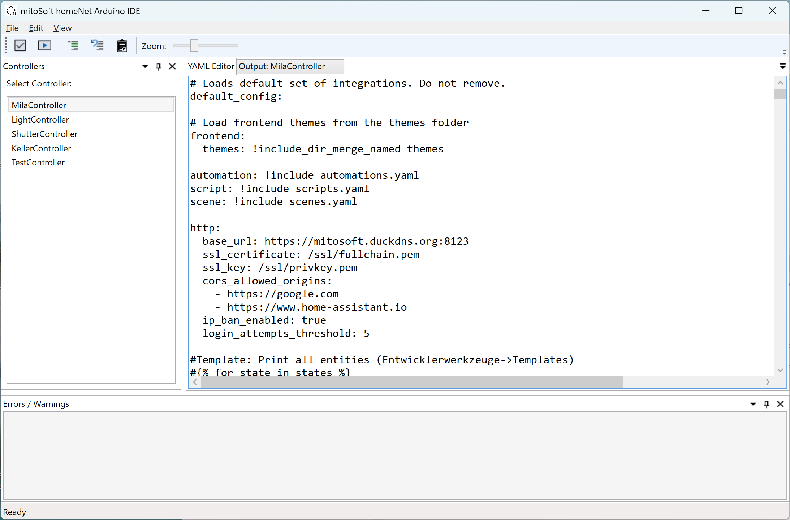
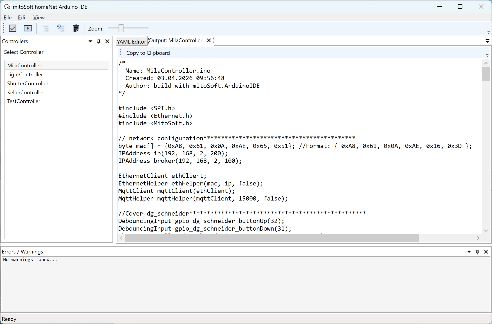

# mitoSoft.homeNet.ArduinoIDE

**Arduino Code Generator für Home Assistant Integration**

Eine WPF-Anwendung, die YAML-Konfigurationen von [Home Assistant](https://www.home-assistant.io/) ausliest und automatisch lauffähigen Arduino-Code für Arduino Mega generiert, um kabelgebundene Geräte wie Rollläden und Lichter über GPIO-Pins zu steuern.

## 🎯 Überblick

Dieses Tool vereinfacht die Erstellung von Arduino-Programmen für die Hausautomatisierung, die mit Home Assistant über MQTT kommunizieren. Statt manuell Arduino-Code zu schreiben, definieren Sie Ihre Controller und kabelgebundenen Geräte (Rollläden, Lichter, etc.) in einer YAML-Datei und generieren den kompletten Arduino-Code mit einem Klick.

### Workflow

```
Home Assistant YAML → mitoSoft.homeNet.ArduinoIDE → Arduino Code → Arduino Mega
                                                           ↓                ↓
                                                   mitoSoft.homeNet    GPIO-Pins
                                                   Arduino Library        ↓
                                                                    Rollläden/Lichter
                                                                    (kabelgebunden)
```

### Wie funktioniert es?

1. **Home Assistant Konfiguration**: Sie definieren in Ihrer `configuration.yaml` MQTT-Entities (Lichter, Rollläden, etc.)
2. **homeNet-Abschnitt**: Im gleichen YAML fügen Sie den `homeNet:`-Abschnitt hinzu, der die Hardware-Zuordnung definiert (GPIO-Pins, Laufzeiten, etc.)
3. **Code-Generierung**: Das Tool liest beide Abschnitte und generiert Arduino-Code für den Arduino Mega
4. **Upload**: Der generierte Code nutzt die mitoSoft.homeNet.Arduino Library und läuft auf Arduino Mega
5. **GPIO-Steuerung**: Der Arduino Mega steuert kabelgebundene Rollläden, Lichter und Taster über GPIO-Pins
6. **MQTT-Kommunikation**: Der Arduino-Controller kommuniziert über Ethernet/WiFi-Shield mit dem MQTT-Broker und Home Assistant

## 🚀 Features

- **YAML-Editor** mit Syntax-Highlighting und Validierung
- **Controller-Verwaltung** für mehrere Arduino Mega Controller
- **Automatische Code-Generierung** für Arduino-Sketches
- **GPIO-Validierung** zur Vermeidung von Pin-Konflikten
- **Kabelgebundene Steuerung** von Rollläden, Lichtern und Tastern über GPIO
- **MQTT-Integration** für Home Assistant
- **Fehler- und Warnungs-Analyse** vor der Code-Generierung
- **Multi-Document Interface** zum gleichzeitigen Bearbeiten mehrerer Controller

## 📸 Screenshots

### Hauptansicht


*YAML-Editor mit Controller-Liste und Fehleranalyse*

### Generierter Output


*Automatisch generierter Arduino-Code für einen Controller*

## 🏗️ Architektur

Das Projekt besteht aus drei Hauptkomponenten:

### 1. **mitoSoft.homeNet.ArduinoIDE.WPF**
WPF-Benutzeroberfläche mit:
- YAML-Editor
- Controller-Verwaltung
- Fehleranalyse
- Code-Generierung

### 2. **mitoSoft.homeNet.ArduinoIDE.ProgramParser**
Parser und Code-Generator:
- YAML-Parser für Home Assistant Konfigurationen
- Arduino-Code-Generator
- GPIO-Validierung
- Template-Engine für Arduino-Sketches

### 3. **mitoSoft.homeNet.Arduino** ([Repository](https://github.com/michaelroth1/mitoSoft.homeNet.Arduino20))
Arduino-Bibliothek für Arduino Mega:
- MQTT-Client-Implementierung (über Ethernet/WiFi-Shield)
- Rollläden-Steuerung mit Positionsberechnung
- Licht-/Schalter-Steuerung
- Taster-Eingabe mit Debouncing
- Home Assistant MQTT-Integration

## 📋 Voraussetzungen

### Entwicklung
- .NET 10
- Visual Studio 2022 oder höher
- C# 14.0

### Für generierte Arduino-Sketches
- Arduino IDE oder PlatformIO
- Arduino Mega (ATmega2560)
- Ethernet Shield oder WiFi Shield (für MQTT-Kommunikation)
- [mitoSoft.homeNet.Arduino Library](https://github.com/michaelroth1/mitoSoft.homeNet.Arduino20)
- Relais-Boards für Rollläden und Lichter
- Physische Taster (optional)

## 🔧 Installation

1. Repository klonen:
```bash
git clone https://github.com/michaelroth1/mitoSoft.homeNet.ArduinoIDE.git
```

2. Solution in Visual Studio öffnen:
```
mitoSoft.homeNet.ArduinoIDE.sln
```

3. Build und Start:
```
F5 oder Build → Start Debugging
```

## 📝 Verwendung

### YAML-Struktur verstehen

Das Tool arbeitet mit einer erweiterten Home Assistant YAML-Konfiguration. Diese besteht aus zwei Hauptteilen:

#### 1. Home Assistant MQTT-Konfiguration (Standard)
```yaml
mqtt:
  light:
  - name: eg_wohnzimmer
    command_topic: "homenet/moeller/command/LichtWohnenDecke"
    state_topic: "homenet/moeller/state/LichtWohnenDecke"
    payload_on: "on"
    payload_off: "off"
    optimistic: false
    unique_id: arduino_light_eg_wohnzimmer

  cover:
  - name: dg_schneider
    command_topic: "MilasRoomController/In/Shutter2"
    position_topic: "MilasRoomController/Out/Shutter2"
    set_position_topic: "MilasRoomController/In/Shutter2/Pos"
    payload_open: "Up"
    payload_close: "Down"
    payload_stop: "Stop"
    unique_id: arduino_shutter_dg_schneider
```

#### 2. homeNet-Abschnitt (Hardware-Zuordnung)
```yaml
homeNet:
  controller:
  - name: "MilaController"
    subscribed_topic: "MilaController/+/+/command/#"
    unique_id: 1
    ip: "192.168.2.200"
    mac: "0xA8, 0x61, 0x0A, 0xAE, 0x65, 0x51"
    broker: "192.168.2.100"
    gpio_mode: "STANDARD"

  light:
  - unique_id: arduino_light_eg_wohnzimmer
    controller_id: 2
    gpio_pin: 15
    gpio_button: 14

  cover:
  - unique_id: arduino_shutter_dg_schneider
    controller_id: 1
    gpio_open: 46
    gpio_close: 47
    gpio_open_button: 32
    gpio_close_button: 31
    running_time: 18500
```

**Wichtig**: Die `unique_id` in beiden Abschnitten verknüpft die Home Assistant Entity mit der Hardware-Konfiguration!

### Schritt-für-Schritt Anleitung

### 1. YAML-Konfiguration erstellen

Erweitern Sie Ihre Home Assistant `configuration.yaml`:

```yaml
# Standard Home Assistant MQTT-Konfiguration
mqtt:
  light:
  - name: eg_flur
    command_topic: "homenet/moeller/command/LichtEGFlur"
    state_topic: "homenet/moeller/state/LichtEGFlur"
    payload_on: "on"
    payload_off: "off"
    unique_id: arduino_light_eg_flur

# homeNet Hardware-Zuordnung
homeNet:
  controller:
  - name: "LightController"
    subscribed_topic: "EG_OG_LichtController/+/+/command/#"
    unique_id: 2
    ip: "192.168.2.201"
    mac: "0xA8, 0x61, 0x0A, 0xAE, 0x16, 0x3D"
    broker: "192.168.2.100"
    gpio_mode: "INVERTED"

  light:
  - unique_id: arduino_light_eg_flur
    controller_id: 2
    gpio_pin: 2
    gpio_button: 1
```

### 2. Controller auswählen

- YAML-Datei im Editor öffnen oder einfügen
- Controller aus der Liste links auswählen

### 3. Validierung durchführen

- **Check-Button** klicken
- Fehler und Warnungen werden im unteren Bereich angezeigt
- GPIO-Konflikte und Partner-Zuordnungen werden geprüft

### 4. Arduino-Code generieren

- **Build-Button** klicken
- Generierter Code erscheint in neuem Tab
- Code kann direkt kopiert oder als .ino-Datei gespeichert werden

### 5. Auf Arduino hochladen

1. Generierten Code in Arduino IDE öffnen
2. [mitoSoft.homeNet.Arduino Library](https://github.com/michaelroth1/mitoSoft.homeNet.Arduino20) installieren
3. Board auswählen (ESP8266/ESP32)
4. Sketch hochladen

### Erweiterte Features

#### Additional Code
Fügen Sie benutzerdefinierten Code zu Ihrem Controller hinzu:

```yaml
homeNet:
  controller:
  - name: "ShutterController"
    unique_id: 3
    # ... weitere Konfiguration ...
    additional_declaration: |-
      // Windmesser
      DebouncingInput emergencyUp(49);
    additional_code: |-
      if ((topic == "ShutterController/cover/jalousie/command/mode" && message == "emergency") || emergencyUp.risingEdge()) {
        eg_jalousie_schneider.referenceRun();
        eg_terrasse.referenceRun();
      }
```

#### GPIO-Modi
- **STANDARD**: Normal-High = Aus, Low = Ein
- **INVERTED**: Normal-Low = Aus, High = Ein (für Optokoppler/Relais)

#### Switch-Modi für Buttons
- **toggle**: Schalter mit An/Aus-Funktion
- **button**: Taster (kurzer Impuls)

```yaml
light:
- unique_id: arduino_light_dg_decke
  controller_id: 1
  gpio_pin: 48
  gpio_button: 27
  state_off: 0
  state_on: 1
  switch_mode: "button"  # Taster statt Schalter
```

## 🎮 Tastenkombinationen

- **Strg+O** - YAML-Datei öffnen
- **Strg+S** - Aktives Dokument speichern
- **Strg+F** - Suchen
- **Strg+K** - Zeilen kommentieren
- **Strg+U** - Zeilen auskommentieren

## 🔍 YAML-Schema

### Home Assistant MQTT-Abschnitt

Definiert die Entities in Home Assistant (standard MQTT-Integration):

#### MQTT Light
```yaml
mqtt:
  light:
  - name: eg_wohnzimmer              # Anzeigename in Home Assistant
    command_topic: "homenet/moeller/command/LichtWohnenDecke"
    state_topic: "homenet/moeller/state/LichtWohnenDecke"
    payload_on: "on"
    payload_off: "off"
    optimistic: false                # true = sofortiges Feedback ohne State
    unique_id: arduino_light_eg_wohnzimmer  # Verknüpfung mit homeNet
```

#### MQTT Cover (Rollläden/Jalousien)
```yaml
mqtt:
  cover:
  - name: dg_schneider
    command_topic: "MilasRoomController/In/Shutter2"
    position_topic: "MilasRoomController/Out/Shutter2"
    set_position_topic: "MilasRoomController/In/Shutter2/Pos"
    payload_open: "Up"
    payload_close: "Down"
    payload_stop: "Stop"
    position_open: 0                 # Position vollständig geöffnet
    position_closed: 100             # Position vollständig geschlossen
    optimistic: false
    unique_id: arduino_shutter_dg_schneider  # Verknüpfung mit homeNet
```

### homeNet-Abschnitt

Definiert die Hardware-Konfiguration für die Arduino-Code-Generierung:

### Controller
Grundkonfiguration für jeden Arduino Mega Controller:

```yaml
homeNet:
  controller:
  - name: "MilaController"           # Name des Controllers
    subscribed_topic: "MilaController/+/+/command/#"  # MQTT Subscribe Pattern
    unique_id: 1                     # Eindeutige Controller-ID
    ip: "192.168.2.200"              # Statische IP-Adresse
    mac: "0xA8, 0x61, 0x0A, 0xAE, 0x65, 0x51"  # MAC-Adresse
    broker: "192.168.2.100"          # MQTT-Broker IP
    broker_username: "user"          # Optional: MQTT-Benutzername
    broker_password: "passwd"        # Optional: MQTT-Passwort
    gpio_mode: "STANDARD"            # STANDARD oder INVERTED
    additional_declaration: |-       # Optional: Zusätzlicher Code (Deklarationen)
      DebouncingInput emergencyUp(49);
    additional_setup: |-             # Optional: Zusätzlicher Code (Setup)
      pinMode(49, INPUT_PULLUP);
    additional_code: |-              # Optional: Zusätzlicher Code (Loop)
      if (emergencyUp.risingEdge()) {
        // Custom Logic
      }
```

**Wichtige Parameter:**
- `name` - Wird als Dateiname für .ino verwendet
- `unique_id` - Referenz für light/cover Zuordnungen
- `ip` - Statische IP für den Arduino Mega (mit Ethernet Shield)
- `mac` - MAC-Adresse für Ethernet-Verbindung
- `gpio_mode`:
  - **STANDARD**: High = Aus, Low = Ein (Standard-GPIO)
  - **INVERTED**: High = Ein, Low = Aus (für Relais-Boards mit Optokoppler)
- `additional_*` - Für erweiterte Arduino-Funktionalität (z.B. Notfall-Schalter, Wind-Sensoren)

### Light (Lichter/Schalter)

```yaml
homeNet:
  light:
  - unique_id: arduino_light_eg_wohnzimmer  # Muss mit MQTT unique_id übereinstimmen
    description: "Wohnzimmer Deckenleuchte"  # Optional: Beschreibung
    controller_id: 2                # Referenz zur Controller unique_id
    gpio_pin: 15                    # GPIO-Pin für Relais/Ausgang
    gpio_button: 14                 # GPIO-Pin für physischen Taster
    state_off: 0                    # Optional: MQTT-Wert für "Aus" (default: "off")
    state_on: 1                     # Optional: MQTT-Wert für "Ein" (default: "on")
    switch_mode: "toggle"           # Optional: "toggle" (default) oder "button"
```

**Switch Modes:**
- `toggle`: Schalter bleibt in Position (An/Aus)
- `button`: Taster (kurzer Impuls zum Umschalten)

### Cover (Rollläden/Jalousien)

```yaml
homeNet:
  cover:
  - unique_id: arduino_shutter_dg_schneider  # Muss mit MQTT unique_id übereinstimmen
    description: "DG Rollladen Schneiderseite"  # Optional: Beschreibung
    controller_id: 1                # Referenz zur Controller unique_id
    gpio_open: 46                   # GPIO-Pin für Relais "Öffnen" (Motor Richtung 1)
    gpio_close: 47                  # GPIO-Pin für Relais "Schließen" (Motor Richtung 2)
    gpio_open_button: 32            # GPIO-Pin für physischen Taster "Öffnen"
    gpio_close_button: 31           # GPIO-Pin für physischen Taster "Schließen"
    running_time: 18500             # Laufzeit in Millisekunden (vollständig öffnen/schließen)
```

**Wichtig:**
- `running_time`: Gemessene Zeit für kompletten Öffnungs-/Schließvorgang (manuell mit Stoppuhr messen)
- Wird für Positionsberechnung verwendet (0% = offen, 100% = geschlossen)
- GPIO-Pins müssen unterschiedlich sein (kein Pin-Konflikt!)
- **Hardware**: Relais-Board steuert Rollladen-Motor (2 Relais pro Rollladen für Auf/Ab)
- **Sicherheit**: Motor darf nie in beide Richtungen gleichzeitig angesteuert werden (Schutz im Code implementiert)

### Beispiel: Komplette Konfiguration

```yaml
# Home Assistant configuration.yaml

mqtt:
  light:
  - name: eg_flur
    command_topic: "homenet/moeller/command/LichtEGFlur"
    state_topic: "homenet/moeller/state/LichtEGFlur"
    payload_on: "on"
    payload_off: "off"
    unique_id: arduino_light_eg_flur

  cover:
  - name: eg_terrasse
    command_topic: "ShutterController/In/Jalousie"
    position_topic: "ShutterController/Out/Jalousie"
    set_position_topic: "ShutterController/In/Jalousie/Pos"
    payload_open: "up"
    payload_close: "down"
    payload_stop: "stop"
    position_open: 0
    position_closed: 100
    unique_id: arduino_shutter_eg_terrasse

homeNet:
  controller:
  - name: "LightController"
    subscribed_topic: "EG_OG_LichtController/+/+/command/#"
    unique_id: 2
    ip: "192.168.2.201"
    mac: "0xA8, 0x61, 0x0A, 0xAE, 0x16, 0x3D"
    broker: "192.168.2.100"
    gpio_mode: "INVERTED"

  - name: "ShutterController"
    subscribed_topic: "ShutterController/+/+/command/#"
    unique_id: 3
    ip: "192.168.2.202"
    mac: "0xA8, 0x61, 0x0A, 0xAE, 0x16, 0x3E"
    broker: "192.168.2.100"
    gpio_mode: "INVERTED"
    additional_declaration: |-
      DebouncingInput emergencyUp(49);
    additional_code: |-
      if (emergencyUp.risingEdge()) {
        eg_terrasse.referenceRun();  // Notfall: Alle Jalousien hochfahren
      }

  light:
  - unique_id: arduino_light_eg_flur
    controller_id: 2
    gpio_pin: 2
    gpio_button: 1

  cover:
  - unique_id: arduino_shutter_eg_terrasse
    controller_id: 3
    gpio_open: 26
    gpio_close: 27
    gpio_open_button: 24
    gpio_close_button: 25
    running_time: 52000
```

## 🛠️ Technologien

- **.NET 10** - Framework
- **WPF** - Benutzeroberfläche
- **AvalonDock** - Docking-Layout
- **YAML** - Konfigurationsformat
- **Arduino C++** - Generierter Code (für Arduino Mega)
- **MQTT** - Kommunikationsprotokoll
- **Ethernet/WiFi** - Netzwerk-Verbindung für Arduino Mega

## 🤝 Beitragen

Contributions sind willkommen! Bitte erstellen Sie einen Pull Request oder öffnen Sie ein Issue.

## 📄 Lizenz

Siehe [LICENSE](LICENSE) Datei für Details.

## 🔗 Verwandte Projekte

- [mitoSoft.homeNet.Arduino](https://github.com/michaelroth1/mitoSoft.homeNet.Arduino20) - Arduino-Bibliothek für die generierten Sketches
- [Home Assistant](https://www.home-assistant.io/) - Open Source Home Automation Platform

## 📧 Kontakt

Michael Roth - [@michaelroth1](https://github.com/michaelroth1)

Projekt-Link: [https://github.com/michaelroth1/mitoSoft.homeNet.ArduinoIDE](https://github.com/michaelroth1/mitoSoft.homeNet.ArduinoIDE)

---

⭐ Wenn Ihnen dieses Projekt gefällt, geben Sie ihm bitte einen Stern auf GitHub!
